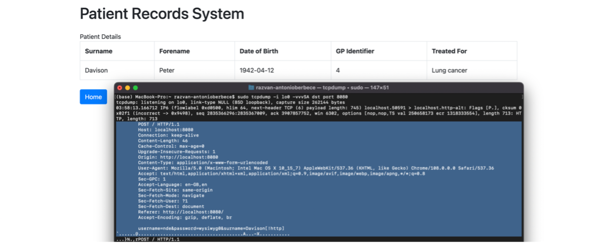
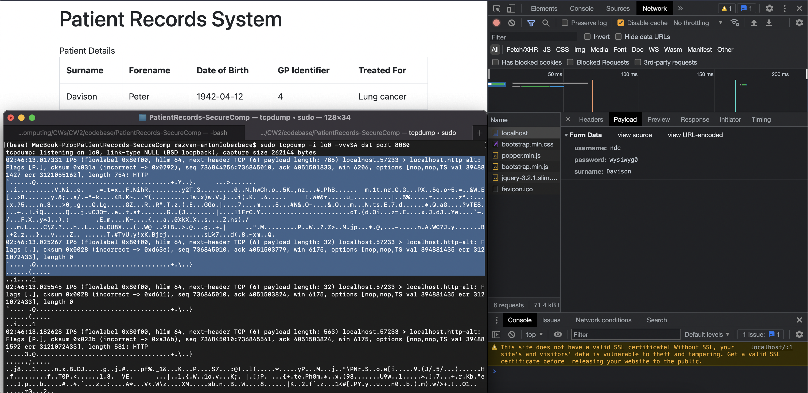

# HTTP used instead HTTPS

We discovered this vulnerability by checking that the protocol used in the URL of the web app (http://localhost:8080/) is indeed HTTP, and by confirming that the Jetty server setup code has no HTTPS configuration implemented or used for the server instantiation.

This vulnerability can be exploited by an attacker if they have access to a machine which runs the patient records application. They could then eavesdrop (through a ‘tcpdump’ command) on the outbound and inbound connections to and from the compromised machine and narrow it down through filtering it by protocol (i.e., HTTP) and / or the port number (i.e., 8080).

This means that the service is vulnerable to:
1.	Information disclosure (of patient data from the response traffic, of account details from request traffic)

The first evidence below depicts what an attacker running the ‘tcpdump’ command on a compromised machine which runs the application could see in the case of an outgoing request. 
Note that the POST form data sent (username, password, surname) is visible and not encrypted.

# Fix
1. Generate a keystore and a self-signed certificate using the command `keytool -genkey -alias appName -keyalg RSA -keystore keystore.jks -keysize 2048`
2. Integrate keystore file into Jetty Java Server application

# Evidence
**Prior to implementing HTTPS**
Note: Command ran on macOS (UNIX pretty much) for this result: `sudo tcpdump -i lo0 -vvvSA dst port 8080`

**Post implementing HTTPS**

# Resources
1. https://dzone.com/articles/adding-ssl-support-embedded