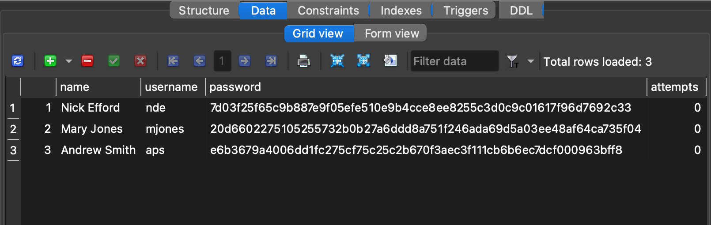
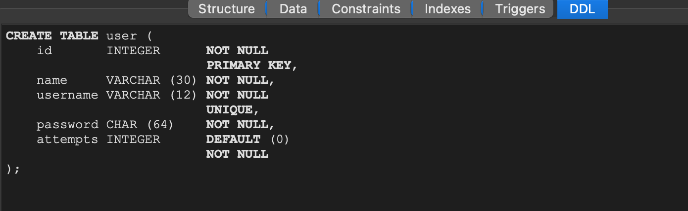

# Password Security Flaw(s)

One of the identified vulnerabilities of the service is that password are generally handled badly:
1. Stored in plain text
2. Allowed to be weak
3. Allowed to be brute-forced

These issues mean that a user profile could easily be compromised. Either by an attacker gaining access to the database in
some way and usign the plain text stored passwords or a brute force attack using common sequences and combinations of 
characters and numbers. Lastly, in this implementation, users are allowed to enter weak credentials, a username which
is non-unique and a password that has no requirement of using a certaing combination of numbers, uppercase and 
lowercase letters or special characters. These flaws were discovered by inspecting the SQL Database using a 
GUI tool, SQLiteStudio, and inspecting the database schema and data stored.

# Evidence
### Screenshot of Basic database that shows the passwords stored in plain text.
Original Database structure

These issues consist of a few different threat types:
1. Spoofing of Identity (gaining access of credentials of some other user)
2. Repudiation (pretending to be some other user using stolen credentials) (?)
3. Information Disclosure (attacker gaining access to data they are not supposed to)
4. Elevation of Privilege (anonymous user elevating to registered user)

In order to secure the application we went ahead and applied 2 different measures. First, we implemented a requirement of a unique
usernames in the database, however a fully robust implementation using more secure passwords would require a registration page, 
which is outside the scope of this assignment. Secondly, to improve password security we added the use of
SHA-256 hashed passwords with salt. Our salt is a statically declared Salt attributein ord er to first convert passwords 
that already existed in the database. A fully secure implementation would require a randomly generated password salt and
an empty database, which would salt passwords at the registration process. 

# Code Analysis
Implemented a function `getHashed` that takes a plain string password, hashes it using our salt and returns it as a string. 
This is done using a `MessageDigest` object: `MessageDigest md = MessageDigest.getInstance("SHA-256")`
And is updated using salt: `md.update(salt)`. As the md digest object is in bytes format, it is converted back 
to a string before being returned. 

The application uses the function to compare the text received as password in the login form.
`stmt.setString(2, getHash(password))`
The same fucntion could be used in a registration process, hashing the new password before storing.

# Evidence
### Screenshot of final database data and schema that shows the passwords stored in hashed text.
Final Database structure

Final Schema structure
