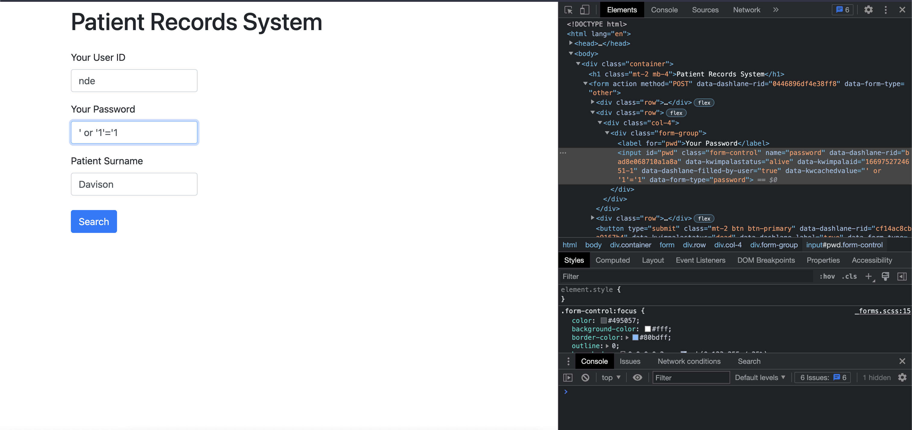
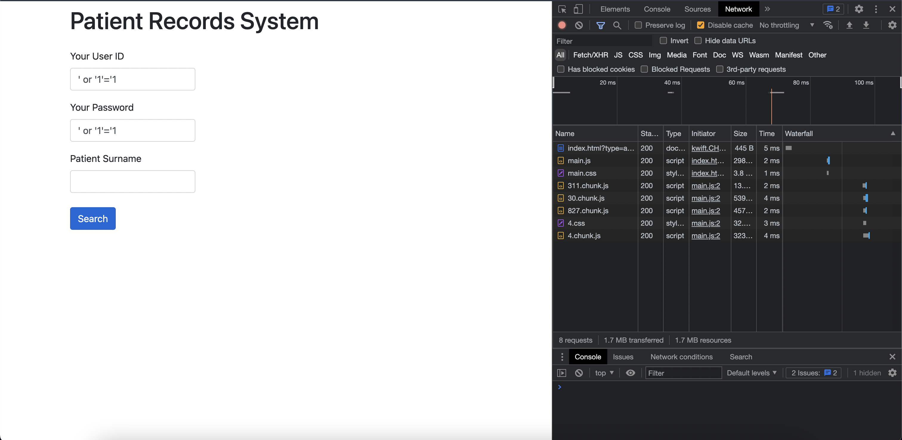

# SQL Injection Security Flaw

One of the identified vulnerabilities of the service is SQL Injection.

The form fields on the `login.html` page have no validation on the client-side and are sent as is to the server.
The server does not do ANY input validation either, which means that the form field values are used in the SQL statements as is.

This means that there are a few very serious threats that the service app is vulnerable to:
1. Information disclosure (reading confidential patient data without needing the required access credentials)
2. Elevation of Privilege (being use the system without being a registered user)

# To Reproduce
## With a valid username
1. Input an existing username from the DB in the username field 
2. Input the `' or '1'='1` string into the password field
3. Submit POST form

**Note**: The username field is vulnerable to SQL injection too, which means that the login portal can be attacked without knowing an existing username either.
## With no username
1. Input the `' or '1'='1` string into the username field
1. Input the `' or '1'='1` string into the password field
2. Submit POST form

The application will display `No records found.` in both cases, which means that the server ran the query with an empty surname string for an unauthorized user (no password or username provided)

# Code Analysis
The authorization SQL query looks like this: `private static final String AUTH_QUERY = "select * from user where username='%s' and password='%s'";`. 

The final populated query is then built using string interpolation `String query = String.format(AUTH_QUERY, username, password);`. 

The query is then executed as-is, which means that for string `"' or '1'='1"`, the final password parameter will be `''`, and that `or '1'='1'` will always evaluate as true, which leads to the `if (authenticated(username, password))` condition to return `True`, and thus the records are then queriable to an unauthorized user. 

# Evidence
### Sequence of screenshots depicting a valid username & malicious password pair successfully querying the database
POST form population

Correct query result + POSTed data payload (on the right hand side of the screenshot, under `Form Data`)

### Sequence of screenshots depicting a malicious username & password pair successfully querying the database
POST form population

Correct query result + POSTed data payload (on the right hand side of the screenshot, under `Form Data`)
